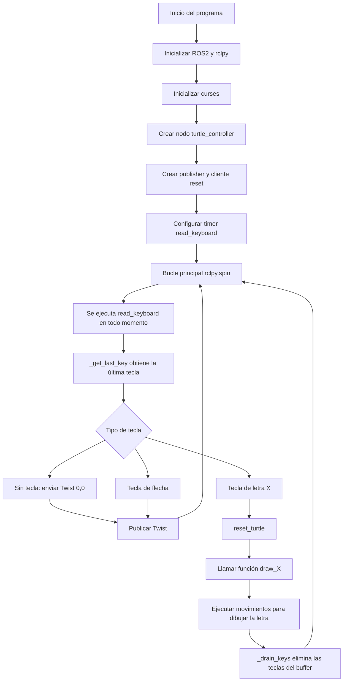

# Laboratorio No. 04 - 2025-II - Robótica de Desarrollo, Intro a ROS 2 Humble - Turtlesim
## Presentado por Juan Esteban Otavo García y Ian Saonni Rodríguez Pulido

En este laboratorio se realizó un primer acercamiento al framework de desarrollo ROS 2 mediante el uso de la aplicación turtlesim. Durante la práctica se llevó a cabo la instalación y configuración inicial del sistema operativo Ubuntu, requerido para el funcionamiento de ROS2. 

Posteriormente, se realizó una pequeña implementación de robótica móvil utilizando turtlesim. En dicha implementación, la tortuga fue controlada desde un nodo independiente mediante un script en Python el cuál utilizó lectura de entradas de teclado para controlar el movimiento de la tortuga y generar diversas trayectorias y movimientos primitivos.

## Procedimiento

Se inició con la instalación y configuración del framework ROS 2 Humble siguiendo las instrucciones descritas en la guía del laboratorio y se habilitó el entorno de trabajo mediante el comando `source /opt/ros/humble/setup.bash`, este comando debe ser utilizado cada vez que se abre una nueva terminal. Luego, se instaló el simulador turtlesim y el software rqt para la monitorización de la implementación.

Con ROS 2 correctamente instalado, se creó un workspace destinado al desarrollo de la práctica. Luego se realizaron las primeras pruebas con turtlesim, un simulador sencillo utilizado para introducir los conceptos fundamentales de ROS. En una primera terminal se ejecutó el nodo principal del simulador y se verificó su comunicación mediante el uso de el nodo turtle_teleop_key, el cuál funcionó como un primer acercamiento al control del movimiento de la tortuga.

Una vez completados los pasos de la guía base, se diseñó e implementó un nodo propio en Python, basado en el nodo move_turtle.py presentado en la guía, destinado a controlar la tortuga mediante entradas de teclado, utilizando las flechas para movimientos primitivos de traslación y rotación.

El nodo implementado interactúa directamente con el tópico `/turtle1/cmd_vel` para publicar las velocidades lineales y angulares requeridas por cada movimiento y lo envía al nodo `/turtle1`, encargado de la simulación. También se utiliza el servicio `/reset` de turtlesim para limpiar la pantalla y reposicionar la tortuga antes de iniciar el dibujo de cada letra.

Este proceso permitió familiarizarse con el entorno y flujo de trabajo de ROS 2, la identificación de nodos y tópicos, así como la interacción entre distintos componentes dentro de un mismo entorno.

## Diagrama de flujo

