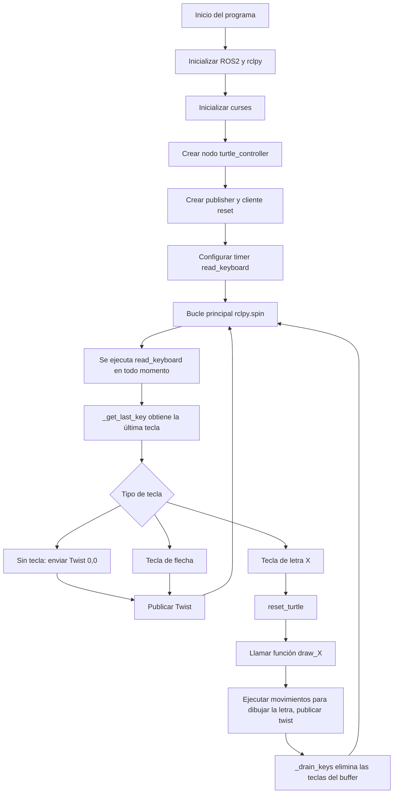

# Laboratorio No. 04 - 2025-II - Robótica de Desarrollo, Intro a ROS 2 Humble - Turtlesim
## Presentado por Juan Esteban Otavo García y Ian Saonni Rodríguez Pulido

En este laboratorio se realizó un primer acercamiento al framework de desarrollo ROS 2 mediante el uso de la aplicación turtlesim. Durante la práctica se llevó a cabo la instalación y configuración inicial del sistema operativo Ubuntu, requerido para el funcionamiento de ROS2. 

Posteriormente, se realizó una pequeña implementación de robótica móvil utilizando turtlesim. En dicha implementación, la tortuga fue controlada desde un nodo independiente mediante un script en Python el cuál utilizó lectura de entradas de teclado para controlar el movimiento de la tortuga y generar diversas trayectorias y movimientos primitivos.

## Procedimiento

Se inició con la instalación y configuración del framework ROS 2 Humble siguiendo las instrucciones descritas en la guía del laboratorio y se habilitó el entorno de trabajo mediante el comando `source /opt/ros/humble/setup.bash`, este comando debe ser utilizado cada vez que se abre una nueva terminal. Luego, se instaló el simulador turtlesim y el software rqt para la monitorización de la implementación.

Con ROS 2 correctamente instalado, se creó un workspace destinado al desarrollo de la práctica. Luego se realizaron las primeras pruebas con turtlesim, un simulador sencillo utilizado para introducir los conceptos fundamentales de ROS. En una primera terminal se ejecutó el nodo principal del simulador y se verificó su comunicación mediante el uso de el nodo turtle_teleop_key, el cuál funcionó como un primer acercamiento al control del movimiento de la tortuga.

Una vez completados los pasos de la guía base, se diseñó e implementó un nodo propio en Python, basado en el nodo move_turtle.py presentado en la guía, destinado a controlar la tortuga mediante entradas de teclado, utilizando las flechas para movimientos primitivos de traslación y rotación.

El nodo implementado interactúa directamente con el tópico `/turtle1/cmd_vel` para publicar las velocidades lineales y angulares requeridas por cada movimiento y lo envía al nodo `/turtle1`, encargado de la simulación. También se utiliza el servicio `/reset` de turtlesim para limpiar la pantalla y reposicionar la tortuga antes de iniciar el dibujo de cada letra.


Este proceso permitió familiarizarse con el entorno y flujo de trabajo de ROS 2, la identificación de nodos y tópicos, así como la interacción entre distintos componentes dentro de un mismo entorno.

## Diagrama de flujo



## Explicación del código

A continuación se describe el funcionamiento del nodo `turtle_controller`, implementado en Python sobre ROS 2 Humble. Este nodo permite controlar la tortuga de `turtlesim` utilizando las flechas del teclado para movimiento manual y ciertas letras para dibujar trayectorias predefinidas. Además, incorpora un mecanismo para evitar la acumulación de teclas en el buffer de la terminal.

---

### Librerias y definición de la clase

```python
import rclpy
from rclpy.node import Node
from geometry_msgs.msg import Twist
from std_srvs.srv import Empty
import curses
import time


class TurtleTeleop(Node):
    def __init__(self, screen):
        super().__init__("turtle_controller")

        self.pub = self.create_publisher(Twist, "/turtle1/cmd_vel", 10)
        self.reset_cli = self.create_client(Empty, "/reset")
        self.linear_speed = 1.5
        self.angular_speed = 1.45
        self.screen = screen
        self.screen.nodelay(True)
        curses.cbreak()

        # Timer que lee el teclado periódicamente
        self.timer = self.create_timer(0.1, self.read_keyboard)

        self.get_logger().info(
            "Moviendo la tortuga: Flechas verticales = Avanzar o Retroceder. Flechas horizontales = Girar. Letras = Dibujar la letra (I S R P J E O G)."
        )
```
En este bloque se importan las librerías necesarias para el funcionamiento del nodo. rclpy y Node corresponden a la API de ROS 2 para Python, mientras que Twist es el tipo de mensaje utilizado para enviar velocidades lineales y angulares a turtlesim mediante el tópico /turtle1/cmd_vel. El servicio Empty se usa para llamar el servicio /reset, el cual reinicia la posición de la tortuga. Las bibliotecas curses y time permiten, respectivamente, gestionar la lectura de teclado en la terminal y manejar tiempos de espera o duraciones de movimientos.

La clase TurtleTeleop hereda de Node por lo que se utiliza como nodo. En el init  se define el nombre interno del nodo "turtle_controller" y se crea un publisher de tipo Twist sobre el tópico /turtle1/cmd_vel, con un tamaño de cola de 10 mensajes. También se define un cliente para el servicio /reset, se fijan las velocidades lineal y angular por defecto, y se configura la función curses para que la lectura de teclado no bloquee la ejecución. Finalmente, se crea un temporizador que ejecuta la función read_keyboard cada 0,1 segundos.


### Antibuffer de teclado

```python
 def _drain_keys(self):
        #Elimina las teclas que se acumulan la cola de entradas de teclado (FUnciona con todas las teclas)
        while True:
            ch = self.screen.getch()
            if ch == -1:
                break

    def _get_last_key(self):
        
        #Devuelve solo la última tecla de la cola de entradas de teclado, para evitar acumulacion (Principalmente para corregir errores de las entradas por flechas)
        last = -1
        while True:
            ch = self.screen.getch()
            if ch == -1:
                break
            last = ch
        return last
```

Estas dos funciones se utilizan como anti–buffers. La función _drain_keys elimina las teclas que se encuentren en la cola de entrada.

Por el otro lado, _get_last_key también recorre la cola de teclado con un bucle y guarda únicamente la última tecla leída. Si no se ha pulsado ninguna tecla desde la última llamada, la función devuelve -1. Con esto se garantiza que, en cada ciclo del temporizador, solo se tenga en cuenta la pulsación más reciente y no una secuencia atrasada de teclas.

### Reset de la tortuga

```python
    #Resetear la posicion de la tortuga
    def reset_turtle(self):
        req = Empty.Request()
        self.reset_cli.call_async(req)
        time.sleep(0.2)
```
La función reset_turtle llama al servicio /reset de turtlesim, el cual limpia la pantalla, reposiciona la tortuga en el centro y restablece su orientación inicial. Se utiliza call_async para invocar el servicio de manera asíncrona y se agrega una delay de 0,2 segundos para permitir que el simulador procese el reset antes de comenzar una nueva rutina.

### Definición de funciones de movimiento en función del tiempo

```python
    # Avance, retroceso, giro horario y antihorario con la velocidad establecida por el tiempo determinado
    def move_forward(self, t):
        msg = Twist()
        msg.linear.x = self.linear_speed
        start = time.time()
        while time.time() - start < t:
            self.pub.publish(msg)
            self._drain_keys() 
            time.sleep(0.01)
        self.stop()

    def move_backward(self, t):
        msg = Twist()
        msg.linear.x = -self.linear_speed
        start = time.time()
        while time.time() - start < t:
            self.pub.publish(msg)
            self._drain_keys()
            time.sleep(0.01)
        self.stop()

    def turn_left(self, t):
        msg = Twist()
        msg.angular.z = self.angular_speed
        start = time.time()
        while time.time() - start < t:
            self.pub.publish(msg)
            self._drain_keys()
            time.sleep(0.01)
        self.stop()

    def turn_right(self, t):
        msg = Twist()
        msg.angular.z = -self.angular_speed
        start = time.time()
        while time.time() - start < t:
            self.pub.publish(msg)
            self._drain_keys()
            time.sleep(0.01)
        self.stop()

    def stop(self):
        msg = Twist()
        self.pub.publish(msg)

```

Las funciones move_forward, move_backward, turn_left y turn_right definen movimientos primitivos en función del tiempo que se utilizaron tanto en el control manual como en el dibujo de letras. Cada función construye un mensaje Twist, asignando una velocidad constante en el componente lineal o angular correspondiente, y ejecuta un bucle mientras no se haya alcanzado el tiempo t especificado.

La función move_forward establece linear.x con el valor positivo de self.linear_speed lo que hace avanzar la tortuga. move_backward utiliza el mismo valor pero con signo negativo para desplazarse hacia atrás. En turn_left se configura angular.z con la velocidad angular positiva para girar en sentido antihorario, mientras que turn_right emplea el valor negativo para realizar el giro horario.

### Dibujo de letras

```python
def draw_I(self):
        self.get_logger().info("Dibujando I")
        self._drain_keys()        
        self.reset_turtle()
        self.turn_left(1)
        self.move_forward(2)

    def draw_S(self):
        self.get_logger().info("Dibujando S")
        self._drain_keys()
        self.reset_turtle()

        self.move_forward(1.5)         
        self.turn_left(1)              
        self.move_forward(1.5)
        self.turn_left(1)              
        self.move_forward(1.5)
        self.turn_right(1)             
        self.move_forward(1.5)
        self.turn_right(1)
        self.move_forward(1.5)

    def draw_R(self):
        self.get_logger().info("Dibujando R")
        self._drain_keys()
        self.reset_turtle()

        self.turn_left(1)
        self.move_forward(3)           # palo vertical
        self.turn_right(1)
        self.move_forward(1.5)         # parte superior
        self.turn_right(1)
        self.move_forward(1.5)         # baja mitad círculo
        self.turn_right(1)
        self.move_forward(1.5)         # vuelve al palo
        self.turn_left(1)
        self.move_forward(1.5)         # patita diagonal

    def draw_P(self):
        self.get_logger().info("Dibujando P")
        self._drain_keys()
        self.reset_turtle()

        self.turn_left(1)
        self.move_forward(3)
        self.turn_right(1)
        self.move_forward(1.5)
        self.turn_right(1)
        self.move_forward(1.5)
        self.turn_right(1)
        self.move_forward(1.5)

    def draw_J(self):
        self.get_logger().info("Dibujando J")
        self._drain_keys()
        self.reset_turtle()

        self.move_forward(1)
        self.turn_left(1.1)
        self.move_forward(2)
        self.turn_left(1.2)
        self.move_forward(0.8)
        self.move_backward(1.6)

    def draw_E(self):
        self.get_logger().info("Dibujando E")
        self._drain_keys()
        self.reset_turtle()

        self.turn_left(1.05)
        self.move_forward(3)      
        self.turn_right(1.03)
        
        self.move_forward(1.5)    
        self.move_backward(1.5)
        self.turn_left(1.03)
        for _ in range(2):
            self.move_backward(1.5)    
            self.move_forward(1.5)      
            self.move_backward(1.5)
            self.turn_left(1.03)

    def draw_O(self):
        self.get_logger().info("Dibujando O")
        self._drain_keys()
        self.reset_turtle()
        self.turn_left(1)
        msg = Twist()
        msg.angular.z = 1.0
        for _ in range(2):
            self.move_forward(2)
            self.turn_left(1.1)
            self.move_forward(1.7)
            self.turn_left(1.1)

    def draw_G(self):
        self.get_logger().info("Dibujando G")
        self._drain_keys()
        self.reset_turtle()
        self.turn_left(1)
        self.move_forward(3)
        self.turn_right(1)
        self.move_forward(1.5)
        self.move_backward(1.5)
        self.turn_left(1)
        self.move_backward(3)
        self.turn_right(1)
        self.move_forward(1.5)

        for _ in range(2):
            self.turn_left(1)
            self.move_forward(1)
        self.turn_left(1.23)
        self.move_forward(0.5)
```


El dibujo de letras se implementó combinando movimientos definidos en función del tiempo (traslación y rotación) para generar trayectorias que aproximan la forma de cada carácter (I, S, R, P, J, E, O y G). Estas trayectorias no se obtuvieron de un cálculo geométrico exacto, sino de manera experimental, ajustando los tiempos de avance y giro hasta lograr la forma deseada.

Durante el diseño de cada letra se procuró que, siempre que fuera necesario 
la tortuga volviera exactamente por el mismo camino previamente recorrido. De esta forma, los segmentos de retorno se superponen sobre las líneas ya dibujadas y no generan trazos adicionales indeseados.

### Lectura de teclado y lógica principal

La función read_keyboard es ejecutada periódicamente. En cada llamada lee la última tecla pulsada, genera un comando de movimiento traslacional o rotacional fijo si se trata de una flecha, y dispara el dibujo de una letra si se ha pulsado una de las teclas asignadas (I, S, R, P, J, E, O o G).

```python

    #Lectura de teclado

    def read_keyboard(self):
        # Leer solo la última tecla pulsada desde el último ciclo
        key = self._get_last_key()
        msg = Twist()

        # Movimiento normal con flechas
        if key == curses.KEY_UP:
            msg.linear.x = self.linear_speed
        elif key == curses.KEY_DOWN:
            msg.linear.x = -self.linear_speed
        elif key == curses.KEY_LEFT:
            msg.angular.z = self.angular_speed
        elif key == curses.KEY_RIGHT:
            msg.angular.z = -self.angular_speed
        else:
            msg.linear.x = 0.0
            msg.angular.z = 0.0

        self.pub.publish(msg)

        # Dibujo de letras
        if key in [ord("I"), ord("i")]:
            self.draw_I()
        if key in [ord("S"), ord("s")]:
            self.draw_S()
        if key in [ord("R"), ord("r")]:
            self.draw_R()
        if key in [ord("P"), ord("p")]:
            self.draw_P()
        if key in [ord("J"), ord("j")]:
            self.draw_J()
        if key in [ord("E"), ord("e")]:
            self.draw_E()
        if key in [ord("O"), ord("o")]:
            self.draw_O()
        if key in [ord("G"), ord("g")]:
            self.draw_G()
```
Primero se llama a _get_last_key para obtener la última tecla registrada desde el ciclo anterior del temporizador. Si la tecla corresponde a una flecha, se transmite el mensaje Twist correspondiente para generar traslación o rotación. Si no hay una tecla válida (o no se ha pulsado ninguna), se envía un mensaje con velocidades nulas, manteniendo la tortuga en reposo. Este mensaje se publica inmediatamente en el tópico /turtle1/cmd_vel.

Después, la función revisa si la tecla coincide con alguna de las letras configuradas para dibujo. Si se pulsa una letra válida se llama a la función draw_X correspondiente.

## Video de Desarrollo e Implementaciòn
[](https://www.youtube.com/watch?v=PQpmsUW5etU)
